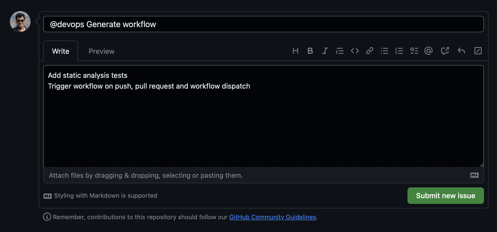
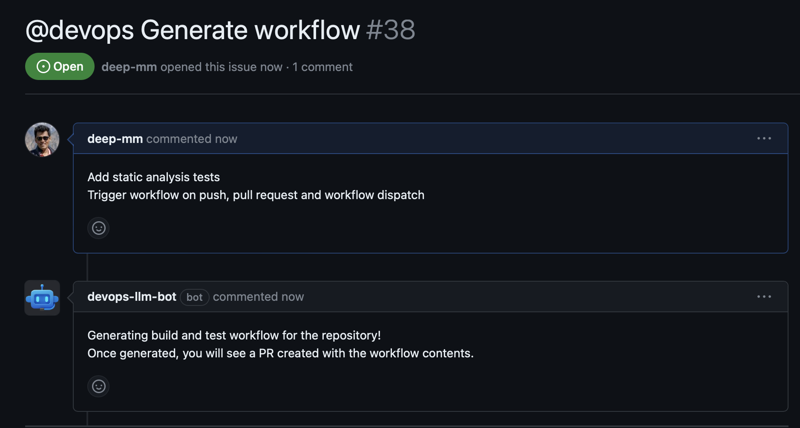
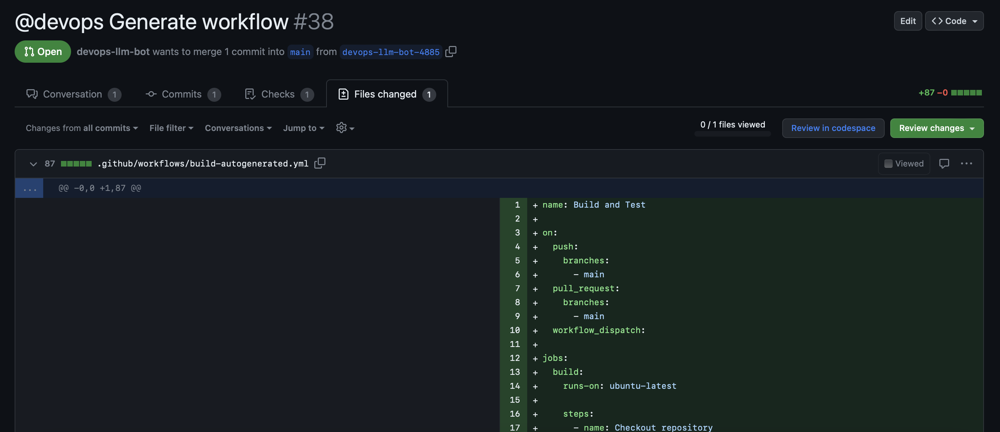
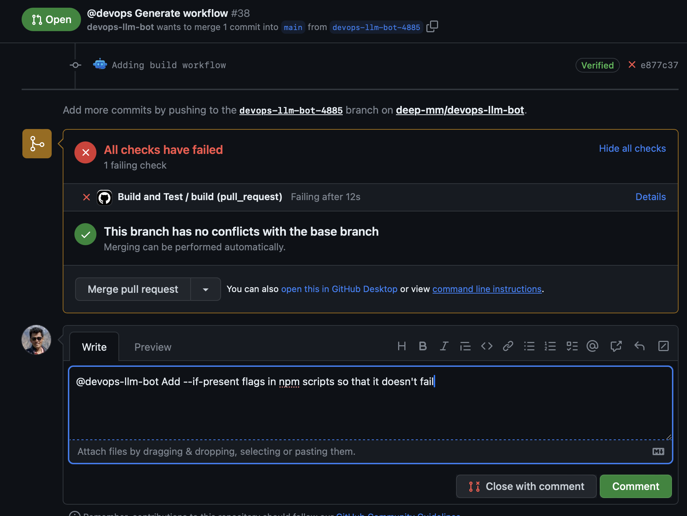
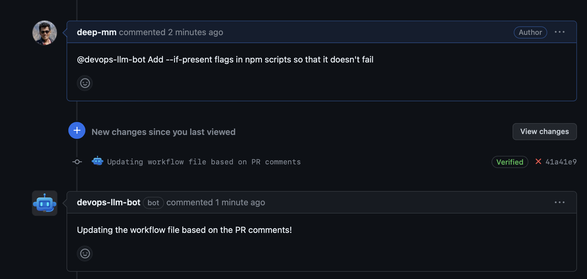

# DevOps LLM Bot 🤖

## DevOps-LLM-Bot: Generate GitHub workflows utlizing the power of LLMs

Use this bot as a Junior DevOps Engineer at your company that can work under the guidance of your Senior engineers. Leave the grunt work to this engineer while your senior engineers focus on the architecture and design of your system.

Ask it to generate build & test workflows, it will utilize the following context from your repository including:

1. Repository file structure (Just the file names and path)
2. Repository dependencies
3. Repository languages

Additionally, you can make custom requests for the bot to consider.

## How to use?

1. Create a new issue with title beginning with @devops, which would trigger the bot to help you generate your workflow. The issue description will be used by the bot to consider any custom requests while generating the workflow.

    

2. Next, you should see a comment on your issue provided by the bot mentioning that your request is in process.

    

3. After about a minute, you will see the issue transforms into a pull request and your workflow file is generated.

    

4. If you are happy with the workflow, you can go ahead and merge your pull request.

5. If you want any modifications, just add a comment in the pull request mentioning the changes required. Just ensure the comment begins with '@devops-llm-bot', this will trigger the bot to consider your changes and re-generate the workflow.

    

6. Once generated, the bot will reply on the PR and add a new commit.

    

7. Feel free to explore the bot with this example PR: https://github.com/deep-mm/myExpressApp/pull/40

----

## DISCLAIMER

1. This bot is currently only capable of generating build and test steps in workflow, and will not entertain any requests to add deploy steps.

2. Please use this bot responsibly and under the guidance of experiences developers.

3. Please don't exploit the free app currently by making unnecessary calls.

## We love our contributors ❤️❤️

Make a [pull request](https://github.com/deep-mm/devops-llm-bot/compare) to help contribute.

